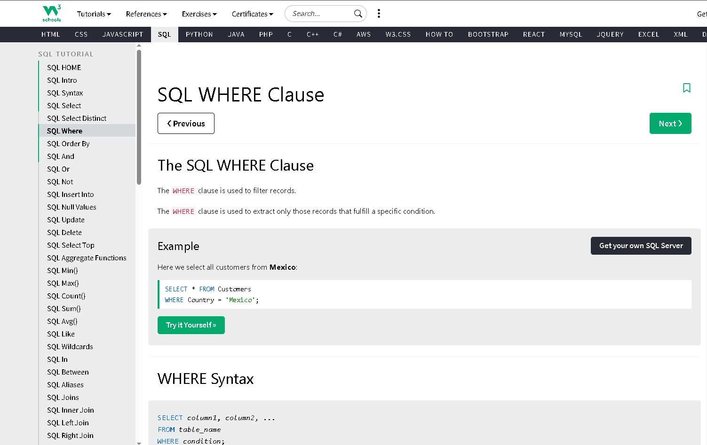
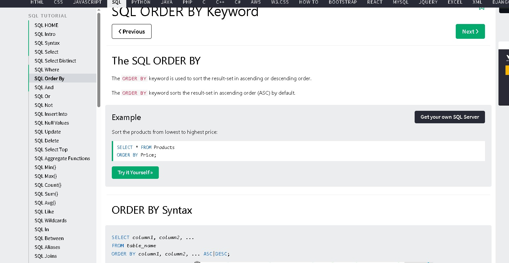
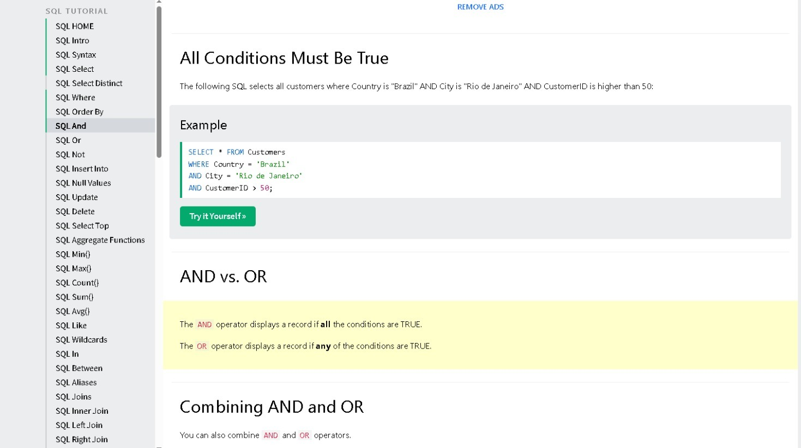

# SQL WHERE Clause

La cláusula WHERE se usa para filtrar registros. 
Solo devuelve los registros que cumplen la condición que le pongas.

Ejemplo: 
``sql
SELECT * FROM Customers WHERE Country = 'Mexico';

# SQL ORDER BY

La cláusula ORDER BY ordena los resultados. 
Por defecto los ordena de forma ascendente ASC. También puedes usar DESC para descendente.

Ejemplo:
``sql
SELECT * FROM Products ORDER BY Price DESC;

# SQL AND

El operador AND requiere que todas las condiciones sean verdaderas.
Si una falla, no devuelve ese registro.

Ejemplo:
``sql
SELECT * FROM Customers
WHERE Country = 'Brazil' 
AND City = 'Rio de Janeiro' 
AND CustomerID > 50;

