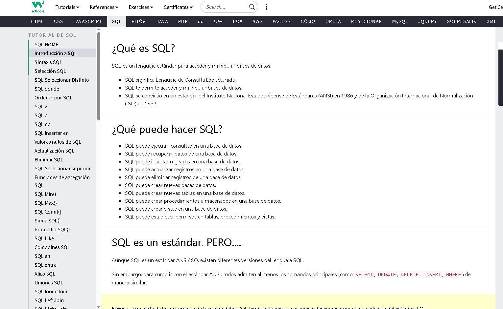
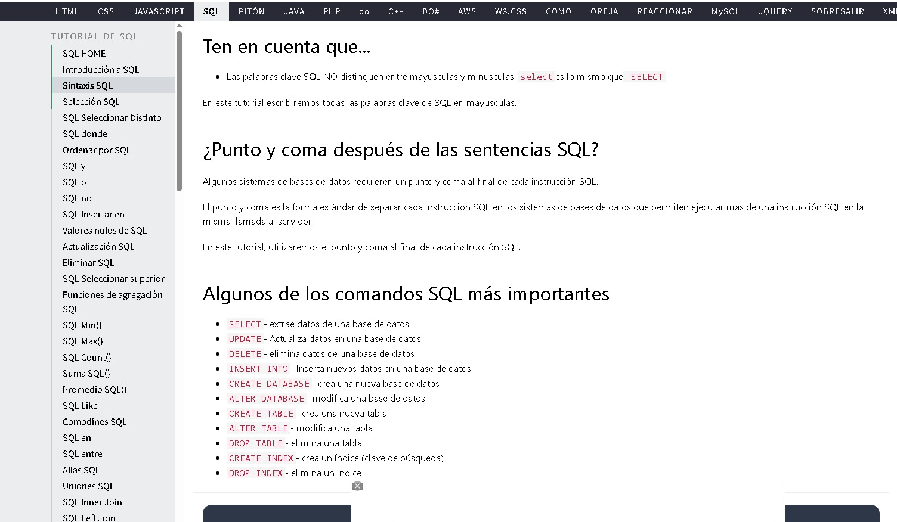
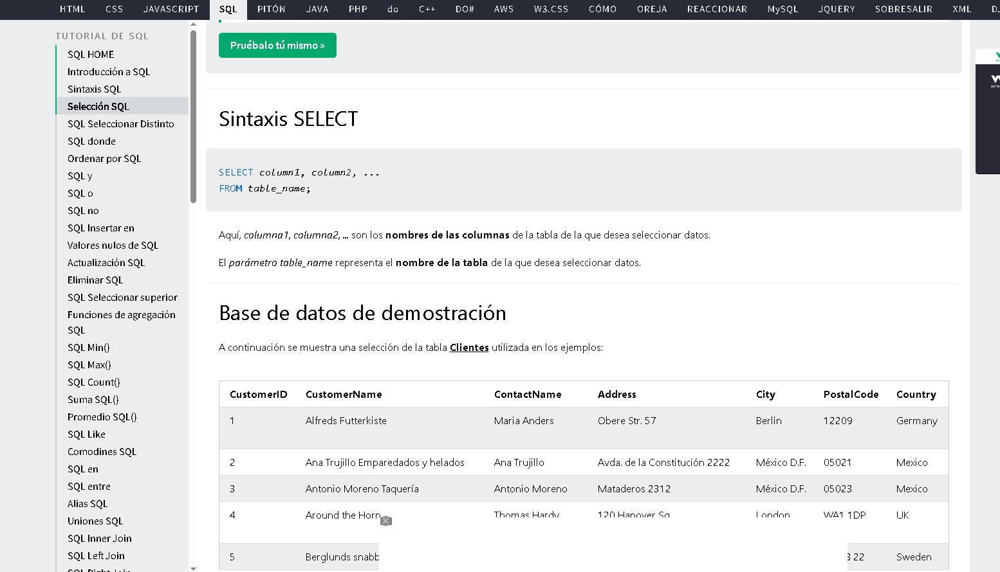
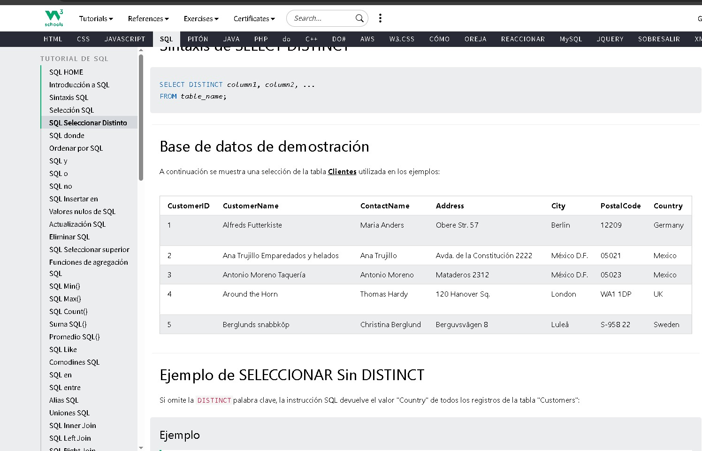

# 01. Introducción a SQL

## ¿Qué es SQL?
SQL = Lenguaje de Consulta Estructurada `Structured Query Language´
Es el lenguaje estándar para hablar con las bases de datos.

## ¿Qué puede hacer SQL?
- `SELECT´: Consultar datos
- `INSERT': Insertar registros
- `UPDATE': Actualizar registros 
- `DELETE': Eliminar registros
- `CREATE': Crear DB y tablas

## Nota Importante
SQL es estándar ANSI/ISO desde 1986-1987. 
Todos los gestores usan los mismos comandos básicos.

**Fecha:** 08/09/2026

# 02. Sintaxis SQL

## Reglas básicas
1. Las palabras clave NO distinguen mayúsculas.
2. Buena práctica: Escribir en MAYÚSCULAS
3. Usar `;´ al final de cada sentencia

``sql
SELECT * FROM Customers;

# 03. Comando SELECT

El `SELECT´ sirve para consultar y traer datos de una tabla.

## Sintaxis
``sql
SELECT columna1, columna2
FROM nombre_tabla;

# 04. SELECT DISTINCT

## ¿Para qué sirve?
Quitar valores duplicados y mostrar solo únicos.

## Sintaxis
``sql
SELECT DISTINCT column1, column2,...
FROM table_name;

